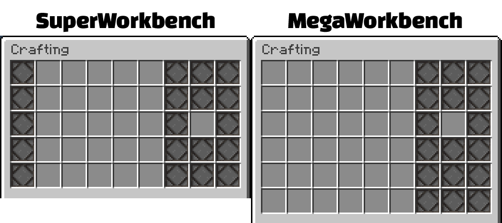

# 物品配方

MMOItems允许您注册自定义配方，您可以使用如工作台、熔炉甚至营火等方块来合成MMOItems。物品可以在同一种或不同种类的合成类型中拥有多个配方。例如，如果您希望玩家能够烹饪美食牛排，可以将该物品的配方注册在熔炉、烟熏炉或营火，或同时注册在这三种合成类型中。您只需为这三种合成类型分别创建一个配方。配方支持原版物品和MMOItems。此外，任何您创建的与原版配方相同的配方（例如将石块合成成石按钮）将被自定义配方覆盖。请记住，每次创建新配方或编辑现有配方后，必须执行 `/mi reload recipes`。

目前有9种不同的合成类型，您可以将它们分配给物品，每种类型对应于合成方块或命令。

创建可合成物品的初始设置与任何其他 MMOItem 相同，您需要定义其属性、名称、说明等。然而，在基本级别下，您需要添加一个crafting选项，并在该选项下添加合成类型。目前可用的9种合成类型是：`smithing、supershaped、smoker、furnace、shaped、megashaped、campfire、shapeless、blast`。这些名称相当直观。

**强烈推荐使用GUI物品编辑器，因为它使可视化这些配方更加容易。**

``` yaml
#这是一个没有实际配方链接的未完成物品，仅有一个合成类型。
SMOKERRECIPE:
  base:
    name: Smoker
    material: WATER_BUCKET
    crafting:
      smoker: #这定义了您的合成类型。
```

如果您想将多个配方分配给单个合成类型，可以这样做：

``` yaml
SMOKERMULTIPLERECIPES:
  base:
    name: Smoker
    material: WATER_BUCKET
    crafting:
      smoker: #这定义了您的合成类型。
        '1': #这让MMOItems知道在该合成类型（在本例中为smoker）中注册了多个配方。
          input: #稍后解释
        '2':
          input:
```

如果您想将多个配方分配给不同的合成类型，只需在 `crafting` 下的级别添加另一个合成类型。

``` yaml
SMOKERANDFURNACERECIPE:
  base:
    name: Smoker
    material: WATER_BUCKET
    crafting:
      smoker: #这定义了您的合成类型。
        '1': #这让MMOItems知道在该合成类型（在本例中为smoker）中注册了多个配方。
          input: #稍后解释
        '2':
          input:
      furnace:
        '1': 
          input:
```

## 锻造台配方

锻造台配方是升级物品的方式。要在锻造台下设置物品的配方，将合成类型设置为 `smithing`。锻造台配方有几个选项。

**input**是玩家必须 **"输入"** 或插入槽中的物品。您可以将这些物品定义为 `MMOItems` 或原版物品。其基础如下所示。

``` yaml
SMITHINGTABLERECIPE:
  base:
    name: Smithing Table
    material: WATER_BUCKET
    crafting:
      smithing:
          input: m EXAMPLE_MMOITEM_TYPE EXAMPLE_MMOITEM_ID 1.0..|v STONE - 1.0..
                 # m 定义此物品为mmoitem，v 定义为原版物品。
```

input还决定了物品进入的插槽。左侧插槽对应第一个输入，右侧插槽对应第二个输入。强烈推荐使用GUI，因为它使查看配方更加容易。

**drop-gems:** 使任何插入MMOItem的宝石在合成物品时掉落并可恢复。可以为true或false。

**upgrades:** 指定使用作材料的MMOItems上的任何升级（当物品升级时您看到的+X）在合成物品时会发生什么。选项有：ADDITIVE、MAXIMUM、EVEN、MINIMUM和NONE。ADDITIVE将升级等级相加，因此+1物品和+3物品将生成+4物品。MAXIMUM将给予较高的升级等级。因此+1物品和+3物品将生成+3物品。EVEN将平均升级等级。因此+1物品和+3物品将生成+2物品。Minimum将给予较低的升级等级。因此+1物品和+3物品将生成+1物品。NONE不会保留任何升级等级。

**enchantments:** 指定合成物品时材料上的附魔会发生什么。选项与upgrades相同，效果也完全相同。

**output:** 指定合成物品时不会消耗的材料（如蛋糕配方中的牛奶桶变为空桶）。定义方式与input相同。这里的物品不必与input中的相同，可以是完全不同的东西。

**amount** 定义此配方将创建的物品数量。

这是完整配置的样子。

``` yaml
SMITHINGTABLERECIPE:
  base:
    name: Smithing Table
    material: WATER_BUCKET
    crafting:
      smithing:
          input: m EXAMPLE_TYPE EXAMPLE_ID 1.0..|v STONE - 1.0..
          drop-gems: true
          upgrades: ADDITIVE
          enchantments: ADDITIVE
          output: v diamond - 1.0..|v AIR - 1..
          amount: 10
```

此配方在左侧插槽中放置一个MMOItem，在右侧放置一个石块，将掉落宝石并累加材料的升级和附魔等级。它还将输出10个物品，并在合成时返回1个钻石。

## 熔炉/高炉/烟熏炉/营火配方

这四种合成类型具有相同的选项和一般理念。您将材料放入任意矿石/食物的插槽并添加燃料。对于营火，只需右键单击营火并手持材料。

其基础如下所示：

``` yaml
COOKINGRECIPE:
  base:
    name: COOKING RECIPES
    material: WATER_BUCKET
    crafting:
      campfire: #这是为营火，必要时替换为furnace/smoker/blast
        input: []
```

这些是这些合成配方的可用选项。

**input:** 不需要，应定义为 \[\]。

**hidden:** 指定即使玩家解锁了配方，也应从玩家的配方书中隐藏物品。使用 `MMOItem Recipe Books`，即将推出？可以为true或false。

**item:** 指定材料是什么。使用 `m MMOITEM_TYPE MMOITEM_ID AMOUNT` 表示mmoitem，或 `v VANILLA_ID AMOUNT` 表示原版物品。

**exp:** 指定配方应给予的经验值。

**time:** 指定烹饪/冶炼材料所需的时间（以刻为单位）。

完整配置如下所示：

``` yaml
COOKINGRECIPE:
  base:
    name: Cooking Recipe
    material: WATER_BUCKET
    crafting:
      smoker:
          input: []
          hidden: true
          item: v STONE_BRICKS - 1.0..
          exp: 10.0
          time: 10.0
```

在此示例中，在烟熏炉中烹饪一个石砖将返回10点经验值，并需10刻冶炼。

## 普通配方/大型配方/超级配方/无序配方



所有的配方都具有相同的选项。然而，有序配方可以从配方书中隐藏。形状意味着材料必须按特定布局放置才能合成物品，有点像石镐只能一种方式合成。超级配方与大型配方相同，但更大。您可以通过执行 `/superworkbench` 或 `/swb` 和 `/megaworkbench` 或 `/mwb` 分别访问这些工作台。大型配方是 `5x5` 网格，超级配方是 `6x6` 网格。

所有配方都有这些选项：

**input**： 指定合成物品所需材料应放置的插槽。

这是一个普通配方的样子：

``` yaml
SHAPEDRECIPE:
  base:
    name: Shaped
    material: WATER_BUCKET
    crafting:
      shaped:
        '1':
          input:
          - v stone - 1.0..|v AIR 0 1..|v AIR 0 1..
          - v AIR 0 1..|v AIR 0 1..|v AIR 0 1..
          - v AIR 0 1..|v AIR 0 1..|v stone - 1.0..
```

另一种查看方式如下：

``` yaml
SHAPEDRECIPE:
  base:
    name: Shaped
    material: WATER_BUCKET

 crafting:
      shaped:
        '1':
          input:
          - 插槽1|插槽2|插槽3
          - 插槽4|插槽5|插槽6
          - 插槽7|插槽8|插槽9
```

超级形状和超级形状合成配方的输入完全相同，只是有更多列和行以反映更大的合成网格。要使插槽为空，您必须使用 `v AIR 0 1..` 指定。

**output:** 与input的布局完全相同，只是它指定在合成物品时不会被消耗的物品。您还可以使用它为玩家提供新的`“降级”`材料。

**hidden** 指定是否应从配方书中隐藏物品。

无序合成配方与形状配方完全相同，只是确切的布局无关紧要。
